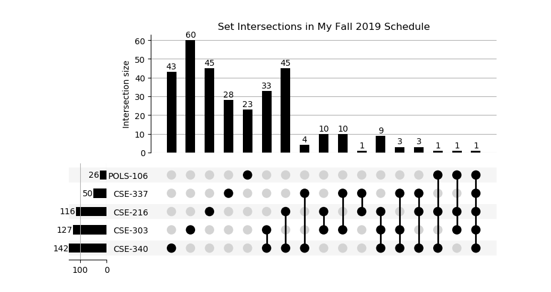
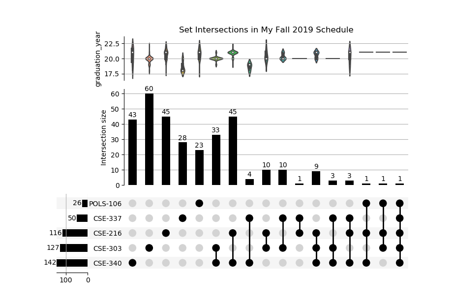
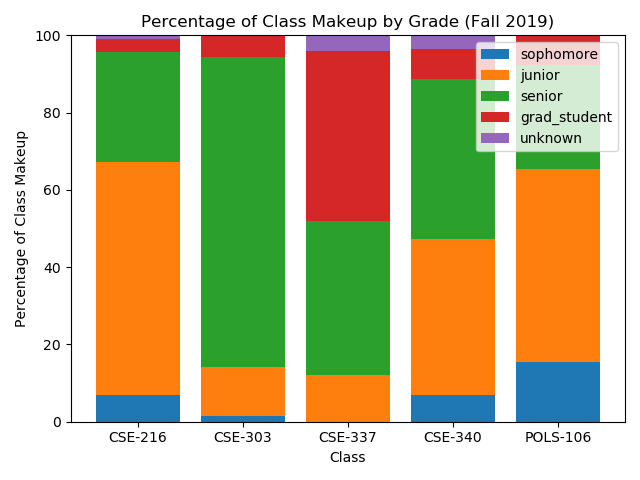

## Which people do I share the most classes with?

Most students think about this question at the beginning of a semester.
They might ask their friends about the classes they're taking, and they'll probably notice a few people who they share a bunch of classes with.
However, I wanted to know the answer to this question definitively, so I decided to scrape my school's coursesite (similar to blackboard) 
using [selenium](https://selenium.dev/projects/).

Firstly, a bit about me: 

I'm currently a Junior at Lehigh University where I'm studying Computer Science & Engineering. My Fall 2019 Schedule was packed with the hard hitting classes which are to be expected as a Junior in CSE.

| ID       | Name                              |
|----------|-----------------------------------|
| POLS-106 | Environmental Values & Ethics     |
| CSE-337  | Reinforcement Learning            |
| CSE-216  | Software Engineering              |
| CSE-303  | Operating System Design           |
| CSE-340  | Design and Analysis of Algorithms |

Onto the scraping:

Every Lehigh student's user page on coursesite contains their ID in the url.
 
 `https://coursesite.lehigh.edu/user/view.php?id=#####`

Every class you're enrolled in has a page which allows you to see all of the class's participants, 
and links to all of their user pages. 

I was able to scrape these participant pages and create a list of participant IDs for each class I was enrolled in.
After cleaning, I plotted the data using the [python UpSet library](https://pypi.org/project/UpSetPlot/).

**NB:** An [UpSet plot](https://caleydo.org/tools/upset/) is a type of graph designed to visualize relationships between a large number of sets.
Oringinally developed for visualizing the similarities between the genomes of organisms, 
it's perfect for this project becuase a venn diagram with more than three sets (classes) would be difficult to read.

**UpSet 101:**
- The horizontal bars to the left of the course IDs are the **total enrollment** for that course.
- A filled dot in a row and column means that everyone in that intersection **took that course**.
  - Multiple filled dots means that everyone in the intersection took all of those courses.
- A empty dot in a row and column means that everyone in that intersection **did not take that course**.
  - Multiple empty dots means that everyone in the intersection did not take any of those courses.
  
For example, we can see that there were four people who took `CSE-337` and `CSE-340`, and did not take any of the other three classes.

**Brief Analysis:**
- I'm the only person who was in all five of my classes.
- No one had four classes with me.
- There was a 17 way tie for people who took three classes with me.

One problem with this graphic is that it doesn't really tell you anything about the people who are in these intersections.

I noticed that some people had added their school emails to their coursesite user page.
Lehigh emails have a format of `INITIALS|NUM|GRAD_YEAR@lehigh.edu`. For example, my email is `ezh221@lehigh.edu`
By scraping people user pages for their emails, 
I was able to determine their graduation years and add this data to the graph as a series of violin plots.

**Brief Analysis:**
- The four people taking only Algorithms & Reinforcment Leaning are all grad students.
- Most people taking Operating Systems and Algorithms are seniors (Class of 2020)
- However, most people taking Software Engineering and Algorithms are juniors (Class of 2021)

Ultimately, I was unhappy with how this graphic displayed the grad year data, so I created a percentage bar chart as well.

**Brief Analysis:**
- Reinforcement Learning is very popular with grad students.
- Operating Systems is made up of almost all seniors.
- There were no first years in any of my classes.

Unfortunately, I don't think this is very readable. Other than a series of pie charts, I'm not
really sure how to express percentages for several different groups well.

#### Spring 2020 classes (stay tuned)

Aside:
> While I kind of breeze past the initial scraping stuff. 
> Even beginning to scrape coursesite was a massive hurdle for me.
> I attempted to use requests, scrapy + splash, and then scrapy + selenium.
> I tried all kinds of different ways to save cookies and headers, 
> but eventually I started using selenium alone because it just worked, and performance wasn't a concern for this project.
> Maybe in the future I'll come back to scrapy and see if it clicks.

Reflections:
- learned: selenium, xpath
- learned some of: pandas, seaborn, matplotlib
- While I didn't do it in this project. I really should have defined classes or namedtuples which represented the data I was scraping.
  It eventually became quite annoying when every object, whether it was a user profile, or a course, or an entry in a
  participants list was a dict instead of a class.